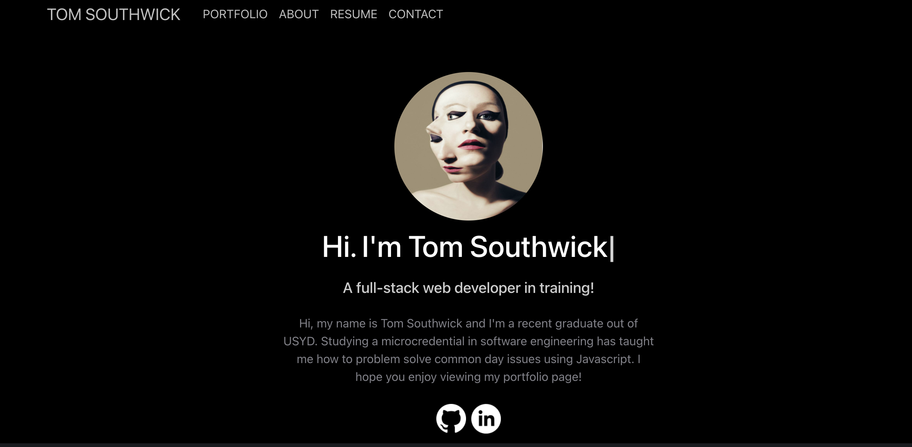

[![Issues][issues-shield]][issues-url]
[![MIT License][license-shield]][license-url]
[![linkedin][linkedin-shield]][linkedin-url]

  
  

<h1 align="center">Portfolio Page</h1>

  

    My Portfolio page is my final piece of work for USYD-Triology education. I've created a Portfolio page using react and javascript to demonstrate my learnings throughout the course.
     
    <a href="https://github.com/TomSouthwick/TomSouthwick"><strong>Explore the docs »</strong></a>
     
     
    ·
    <a href="https://glacial-forest-03903.herokuapp.com"><strong>View App</strong></a>
    ·
    <a href="https://github.com/TomSouthwick/TomSouthwick">Report Bug</a>
    ·
    <a href="https://github.com/TomSouthwick/TomSouthwick">Request Feature</a>
  

  
  
<!-- TABLE OF CONTENTS -->
<h3/>
<b/>

  
Table of Contents

  <ol>
    <li>
      <a href="#about-the-project">About The Project</a>
      <ul>
        <li><a href="#built-with">Built With</a></li>
      </ul>
    <li><a href="#roadmap">Roadmap</a></li>
    <li><a href="#license">License</a></li>
    <li><a href="#contact">Contact</a></li>
    <li><a href="#acknowledgments">Acknowledgments</a></li>
  </ol>

</h3>
</b>
  
  

<!-- ABOUT THE PROJECT -->

## About The Project

  

  

My portfolio page is designed to showcase my collection of work throughout my time at USYD. With each major listed on the page, I have decided to showcase some of the more difficult tasks. Whilst there was alot of focus on back-end development, show casing schema design was a little more tricky. I aim to include those projects in sometime within the future

(<a href="#top">back to top</a>)

### Built With

- [Bootstrap](https://getbootstrap.com/)
- [React](https://reactjs.org/)
- [Javascript](https://www.javascript.com/)
- [My Very Own Projects](https://github.com/TomSouthwick?tab=repositories)

(<a href="#top">back to top</a>)

<!-- ROADMAP -->

## Roadmap

- ✅ Sketching out a template
- ✅ Creating a react app
- ✅ Designing UI flow
- ✅ Building out each section
- ✅ Styling different components
  - ✅ Deciding which projects to showcase
- ✅ Making the app mobile responsive!

See the [open issues](https://github.com/TomSouthwick/TomSouthwick/issues) for a full list of proposed features (and known issues).

(<a href="#top">back to top</a>)

<!-- CONTRIBUTING -->

<!-- LICENSE -->

## License

Distributed under the MIT License. See `LICENSE.txt` for more information.

(<a href="#top">back to top</a>)

<!-- CONTACT -->

## Contact

Tom Southwick - [Linkedin](https://linkedin.com/in/tomsouthwick)

Project Link: [https://github.com/TomSouthwick/TomSouthwick](https://github.com/TomSouthwick/TomSouthwick)

(<a href="#top">back to top</a>)

<!-- ACKNOWLEDGMENTS -->

## Acknowledgments

- [ReadMe](https://github.com/othneildrew/Best-README-Template.git)

(<a href="#top">back to top</a>)

<!-- MARKDOWN LINKS & IMAGES -->
<!-- https://www.markdownguide.org/basic-syntax/#reference-style-links -->

[issues-shield]: https://img.shields.io/github/issues/TomSouthwick/TomSouthwick.svg?style=for-the-badge
[issues-url]: https://github.com/TomSouthwick/TomSouthwick/issues
[license-shield]: https://img.shields.io/github/license/TomSouthwick/Team-Profile-Generator.svg?style=for-the-badge
[license-url]: https://github.com/TomSouthwick/TomSouthwick/blob/master/LICENSE.txt
[linkedin-shield]: https://img.shields.io/badge/-LinkedIn-black.svg?style=for-the-badge&logo=linkedin&colorB=555
[linkedin-url]: https://linkedin.com/in/tomsouthwick
[product-screenshot]: images/screenshot.png
